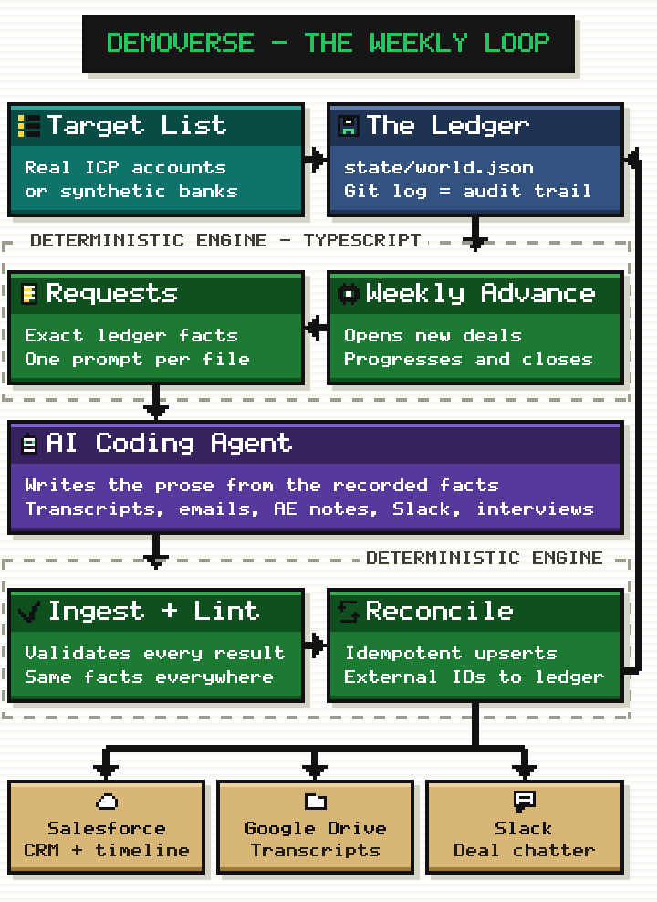
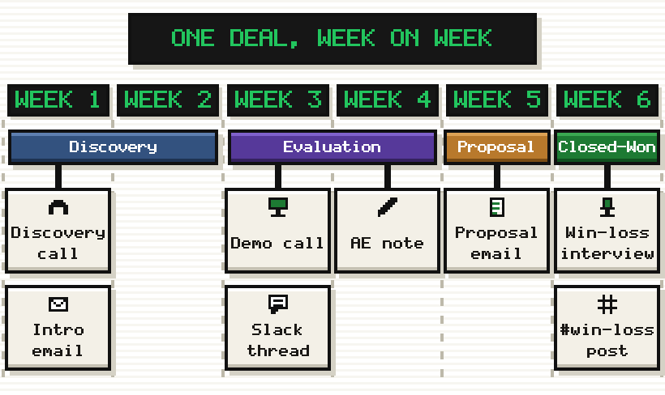

<p align="center">
  
</p>

<h1 align="center">Demoverse</h1>

<p align="center">
  <b>Grow a fake company's entire sales history across CRM, calls, email and Slack.<br> Then keep it moving, week after week.</b>
</p>

<p align="center">
  <a href="https://github.com/calven-ai/demoverse/actions/workflows/ci.yml"></a>
  <a href="LICENSE"></a>
  = 20">
  <a href="CONTRIBUTING.md"></a>
</p>

<p align="center">
  <a href="#quick-start">Quick start</a> ·
  <a href="#how-it-works">How it works</a> ·
  <a href="docs/getting-started.md">Docs</a> ·
  <a href="docs/connectors/build-your-own.md">Connectors</a> ·
  <a href="docs/faq.md">FAQ</a> ·
  <a href="#project-status">Status</a>
</p>

---

Every B2B product demo dies the same death. The environment is **empty**,
**half-populated**, or **obviously fake**. Ten accounts and no contacts. Uniform
CRM notes. Every deal neatly debriefed. The same three phrases in every call
transcript. An audience smells generated data in seconds, and your product has
nothing real to show off.

The deeper problem is that demo data is built **once**. Somebody seeds it before
a launch, and from that moment it is a photograph: every deal frozen at the
stage it was born in, nothing opened, nothing closed, no history behind it and
no next week ahead of it. It also ages badly, drifting further out of date with
every month that passes.

That quietly kills the demos worth giving. **Anything interesting about a
sales org is a trend**, not a snapshot: pipeline building over a quarter, win
rate recovering, a competitor showing up in more deals than it did in March,
one segment pulling ahead of another. A dataset with no past cannot show a
trajectory, so the charts stay flat, the dashboards have nothing to say, and
you end up narrating what the product *would* show if the data were real.

Demoverse builds the alternative. You define a **fictional company**. The engine
keeps a **deterministic ledger** of accounts, buying committees, deals and
correlated win/loss outcomes, and **advances it one week at a time**, so history
accumulates the way it does in a real company. Steer the direction as you go and
the trends bend with it. On top of that ledger, **your coding agent generates
the content**: call transcripts, AE notes, email threads, Slack chatter,
win-loss interviews, each written from a prompt the engine grounds in the facts
it just recorded. Every artifact tells the same story as the CRM record it
belongs to. A curated cohort of deals gets pushed into
Salesforce, HubSpot, Google Drive and Slack, where your product ingests it like
production data.

### Works with

<p align="center">
  <a href="CLAUDE.md"></a>
  <a href="AGENTS.md"></a>
  <a href="AGENTS.md"></a>
  <a href="AGENTS.md"></a>
</p>

<p align="center">
  <b><a href="CLAUDE.md">Claude Code</a> · <a href="AGENTS.md">Codex</a> · <a href="AGENTS.md">Cursor</a> · <a href="AGENTS.md">any AGENTS.md-aware tool</a></b><br>
  <sub>the agent you already run is what generates the content: call transcripts, email threads, Slack messages, win-loss interviews</sub>
</p>

Pushes into [Salesforce](docs/connectors/salesforce.md),
[HubSpot](docs/connectors/hubspot.md),
[Google Drive](docs/connectors/google-drive.md),
[Slack](docs/connectors/slack.md), or
[a connector you write yourself](docs/connectors/build-your-own.md).

**And there is nothing extra to pay for.** Demoverse asks for no model API key.
Generation runs in the coding agent you already subscribe to, and everything
else runs locally. Connectors stay switched off until you hand them credentials,
and even then they only touch the sandbox org or workspace you point them at.

## How it works

One split runs through the whole system: a **deterministic engine owns every
fact**, and your **coding agent owns only the words**. The engine decides what
happened; the agent writes it up from prompts that carry those facts, so it can
never invent one.

<p align="center">
  
</p>

1. **You define a fictional company** in plain YAML (`config/`): product,
   competitors, personas, sales team, market segments. The `/setup` wizard
   interviews you and writes it for you.
2. **A target list seeds the accounts.** Point it at a CSV of real ICP companies
   you want to see in the demo, or let the engine draw from its synthetic banks.
3. **The ledger holds the world.** `state/world.json` is the single source of
   truth for accounts, contacts, deals, outcomes and external ids. It is
   versioned JSON committed to git, so the git log doubles as an audit trail.
   Nothing hand-edits it.
4. **The weekly advance moves the pipeline.** It opens a couple of new deals,
   progresses open ones a stage, and closes the ones whose cycle is up.
   Everything is seeded and deterministic. Outcomes correlate with ICP fit,
   competitor strength and multi-threading, so dashboards built on it show real
   patterns.
5. **It emits grounded prompts**, one per touch point a deal actually earned.
   Each one carries the exact facts (people, competitors, recorded outcome) plus
   a per-deal variety texture, so no two deals read alike.
6. **Your agent writes the prose** into result files: transcripts, emails, AE
   notes, Slack posts, win-loss interviews. One subagent per deal keeps them
   from blurring together.
7. **Ingest and lint check the work.** A validating ingest step files each
   result, and a coherence linter proves the transcript, the CRM record and the
   Slack thread never contradict each other. Anything that fails stays unfiled
   and is simply re-requested.
8. **Reconcile pushes it out** to Salesforce, HubSpot, Drive and Slack through
   idempotent upserts, recording each external id back on the ledger. Re-runs
   update. They never duplicate.

### One deal, one week at a time

The engine never dumps a finished history. Each run generates only the touch
points a deal actually earned that period, so a deal opened this week has one
discovery call, not a full paper trail. Run it again next week and the same deal
moves a stage and earns another one or two. That is what gives the dataset a
past to chart and a direction to steer.

The six weeks below are one deal's story, not the template. Another closes in a
week, another sits in Evaluation for a month without a word.

<p align="center">
  
</p>

## What makes it believable

- **A deterministic world, an agent-written surface.** The engine owns all
  structure: ids, dates, amounts, referential integrity. The agent only ever
  writes prose against recorded facts. Replays match. Nothing drifts.
- **Grounded, varied prose.** Every prompt carries the deal's facts plus a
  seeded texture: backstory, buyer tone, live objections, timeline pressure,
  artifact shape, and a banned-phrase list. A repetition detector feeds phrases
  back into the blocklist. You edit all of it in `config/prose.yaml`.
- **Living, not a dump.** A typical deal runs about five weeks and earns one to
  three touch points a week. Win-loss debriefs are deliberately scarce (~1 in 3
  closed deals) and AE notes are terse and imperfect. Uniform diligence is what
  makes synthetic data read as synthetic.
- **No two deals the same shape.** Cycle length is drawn per deal, peaking
  around five weeks, and the tails are real: a few warm inbound deals close in a
  week with barely two touch points to their name, a few grind through a
  quarter of procurement, and a few go dark for a month before dying of "No
  decision". Short deals skip stages outright. So your demo has the edge cases a
  real pipeline has, not one archetype repeated three hundred times. Tune or
  disable each one in `config/world.yaml`.
- **Cohort-gated pushes.** The ledger holds hundreds of deals so the statistics
  are real. Only a curated ~50 ever reach external systems, each one fully
  populated. Nothing leaves the repo by accident.

## What Demoverse is not

- **Not a faker/mock-data library.** It doesn't generate random rows. It grows
  one coherent company over time.
- **Not a load-testing dataset.** Volume is intentionally demo-sized.
- **Not for real people or production systems.** Dedicated orgs and fictional
  humans only. See [DISCLAIMER.md](DISCLAIMER.md).
- **Not a model wrapper.** The content *is* AI-generated, just not by Demoverse.
  The engine holds no model key and makes no model API call. It grounds the
  prompts, validates the results, and leaves the generating to the coding agent
  you already run.

|  | faker-style generators | static demo-org snapshot | **Demoverse** |
| --- | :-: | :-: | :-: |
| Cross-record coherence (CRM ↔ calls ↔ Slack) | ✗ | ✓ | ✓ |
| Long-form prose artifacts | ✗ | ✓ | ✓ |
| Moves forward every week | ✗ | ✗ | ✓ |
| Steerable story ("competitor X gets tougher") | ✗ | ✗ | ✓ |
| Deterministic / reproducible structure | ✓ | ✗ | ✓ |
| Pushes into real SaaS orgs | ✗ | ✗ | ✓ |

## Quick start

**Zero credentials, about five minutes.** The world runs entirely locally.

```bash
git clone https://github.com/calven-ai/demoverse
cd demoverse
npm ci
```

Then open the repo in **Claude Code** and run **`/setup`**. The wizard
interviews you, or invents a company from your one-line idea. It writes the
config, initializes the world, and walks you through your first weekly
increment. In **Codex, Cursor, or any AGENTS.md-aware tool**, say:

> Follow the onboarding playbook in AGENTS.md.

Prefer doing it by hand? Copy `config/templates/*.yaml` → `config/`, fill them
in, then:

```bash
npm run init                      # scaffold the world from your config
npm run pipeline                  # advance one week, emit grounded prompts
# fill state/requests/<n>/results/ (your agent, or you)
npm run apply -- --ingest         # validate + file the prose
npm run lint                      # prove the story is coherent
```

**Connect real systems when you're ready.** Each guide takes a few minutes with
a free account, and every connector stays off until you flip it on in
`config/connectors.yaml`:
[Salesforce](docs/connectors/salesforce.md) ·
[Slack](docs/connectors/slack.md) ·
[Google Drive](docs/connectors/google-drive.md) ·
[HubSpot](docs/connectors/hubspot.md)

Full walkthrough: [docs/getting-started.md](docs/getting-started.md).

## FAQ

**Do I need Claude Code?** No, but you do need a coding agent. Any one that
reads [AGENTS.md](AGENTS.md) works (Codex, Cursor, Copilot, …). The agent is
what actually generates the transcripts, emails and Slack threads, so it isn't
an optional convenience. The prompts are self-contained briefs, which means you
can hand-write a result or two to see how the contract works. A world's worth of
them is agent work.

**Is the prose AI-generated? What does it cost?** Yes. Transcripts, emails,
Slack threads and win-loss interviews are all written by a language model. What
Demoverse doesn't do is call one: no model key, no API call, no metered token
bill. Your coding agent does the writing in its own session, on the subscription
you already have. That keeps the engine's facts deterministic while the prose
stays model-written, and it means any writer can fill a request, including a
script of your own against whatever model API you prefer.

**Will it touch my production CRM?** Only systems you explicitly configure, and
it's designed for isolated ones (free Salesforce Developer Edition, throwaway
Slack workspace). Destructive commands are dry-run by default and require
`--confirm`. See [DISCLAIMER.md](DISCLAIMER.md).

**Why do so few deals have win-loss interviews? Why are the AE notes sloppy?**
Because that's what real CRMs look like. Uniform diligence is the tell that
kills demo data. The scarcity and the mess are deliberate, and both are tunable.

**Can I use a different CRM?** HubSpot ships in the box (structure-only), and
the [connector contract](docs/connectors/build-your-own.md) is ~60 lines to
implement for anything else.

**Is it reproducible?** The structural world is fully deterministic from a seed.
Prose varies with whichever agent writes it. Grounding and lint keep it
consistent with the facts either way.

**Why templates instead of a bundled example company?** A canned company would
look identical in every install, and the first Demoverse demo you saw would
spoil every other one. The wizard makes yours yours in minutes.

More in [docs/faq.md](docs/faq.md).

## Project status

**Complete and maintained.** The engine does what it set out to do: a
deterministic world simulation, the grounded-prompt protocol, the coherence
linter, the `/setup` wizard and tool-neutral onboarding, and connectors for
Salesforce, Google Drive, Slack and HubSpot. There is no feature backlog waiting
to land, because the scope was small on purpose.

Maintained means dependency updates, bug fixes, and repairs when a connector's
vendor API changes underneath it. Issues get answered.

New capability is meant to arrive through the two documented seams rather than
through this repo growing: the
[connector contract](docs/connectors/build-your-own.md) for a new system, and
the [request protocol](docs/request-protocol.md) for a new way of filling
prompts. Both are stable, both are roughly an afternoon of work, and neither
needs a fork. If you build something on either one, an issue pointing at it is
welcome. Ideas we would happily merge are listed in
[CONTRIBUTING.md](CONTRIBUTING.md).

## Contributing

Issues and PRs welcome. Start with [CONTRIBUTING.md](CONTRIBUTING.md). Security
reports go through [SECURITY.md](SECURITY.md), never a public issue. Community
standards live in [CODE_OF_CONDUCT.md](CODE_OF_CONDUCT.md).

## License

[MIT](LICENSE). Built by the team at [Calven](https://calven.ai), where a
private deployment of this engine powers the live product demo.
