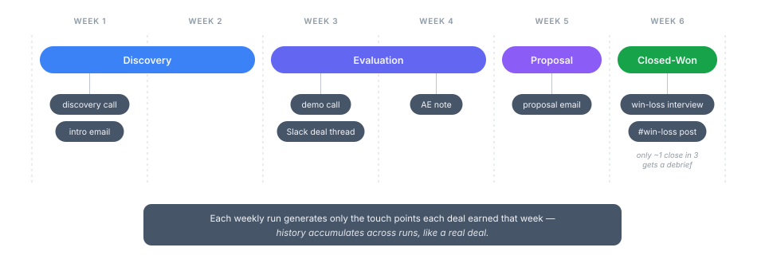
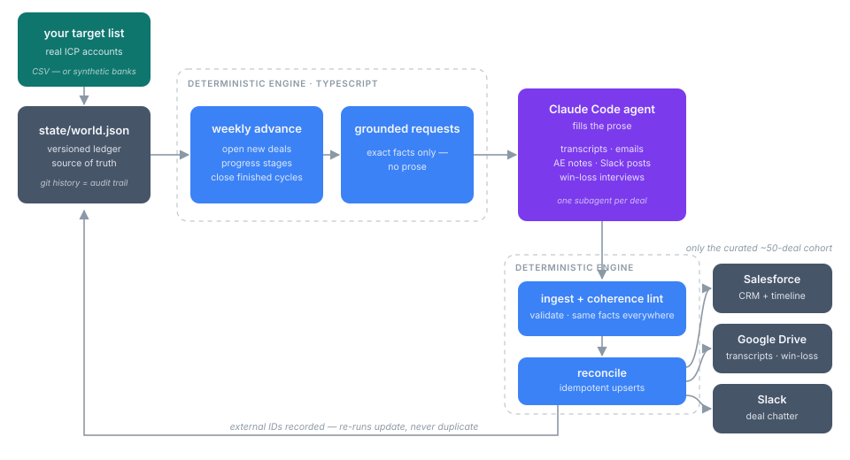

<p align="center">
  
</p>

<h1 align="center">Demoverse</h1>

<p align="center">
  <b>Grow a fake company's entire sales history across CRM, calls, email and Slack. Then keep it moving, week after week.</b>
</p>

<p align="center">
  <a href="https://github.com/calven-ai/demoverse/actions/workflows/ci.yml"></a>
  <a href="LICENSE"></a>
  = 20">
  <a href="CONTRIBUTING.md"></a>
</p>

<p align="center">
  <a href="#quick-start">Quick start</a> ·
  <a href="#how-it-works">How it works</a> ·
  <a href="docs/getting-started.md">Docs</a> ·
  <a href="docs/connectors/build-your-own.md">Connectors</a> ·
  <a href="docs/faq.md">FAQ</a> ·
  <a href="#roadmap">Roadmap</a>
</p>

---

Every B2B product demo dies the same death. The environment is either **empty**
or **obviously fake**. Uniform CRM notes. Every deal neatly debriefed. The same
three phrases in every call transcript. An audience smells generated data in
seconds, and your product has nothing real to show off.

Demoverse builds the alternative. You define a **fictional company**. The engine
keeps a **deterministic ledger** of accounts, buying committees, deals and
correlated win/loss outcomes, and **advances it one week at a time**. On top of
that sits a prose layer written by **your coding agent** from fully grounded
prompts: call transcripts, AE notes, email threads, Slack chatter, win-loss
interviews. Every artifact tells the same story as the CRM record it belongs to.
A curated cohort of deals gets pushed into Salesforce, HubSpot, Google Drive and
Slack, where your product ingests it like production data.

### Works with

| Agents (write the prose) | Destinations (receive the world) |
| --- | --- |
| Claude Code · Codex · Cursor · any [AGENTS.md](AGENTS.md)-aware tool, or no agent at all | Salesforce · HubSpot · Google Drive · Slack · [your own connector](docs/connectors/build-your-own.md) |

No API keys for generation. The prose is written inside the agent session you
already pay for. The core engine needs no credentials at all, and connectors
no-op until you enable them.

## How it works

<p align="center">
  
</p>

1. **You define a fictional company** in plain YAML (`config/`): product,
   competitors, personas, sales team, market segments. The `/setup` wizard
   interviews you and writes it for you.
2. **The engine advances the world one week.** It opens a couple of new deals,
   moves open ones a stage, and closes the ones whose cycle is up. Everything is
   seeded and deterministic. Outcomes correlate with ICP fit, competitor
   strength and multi-threading, so dashboards built on it show real patterns.
3. **It emits grounded prompts**, one per touch point a deal actually earned
   that week. Each one carries the exact facts (people, competitors, recorded
   outcome) plus a per-deal variety texture, so no two deals read alike.
4. **Your agent writes the prose** into result files. A validating ingest step
   files it. A coherence linter proves the transcript, the CRM record and the
   Slack thread never contradict each other.
5. **Connectors push a curated cohort** into your Salesforce, HubSpot, Drive and
   Slack through idempotent upserts. Re-runs update. They never duplicate.
6. **Next week, it moves again.** Deals accumulate history the way real ones do.
   A deal opened this week has one discovery call, not a full paper trail.

<p align="center">
  
</p>

## What makes it believable

- **A deterministic world, an agent-written surface.** The engine owns all
  structure: ids, dates, amounts, referential integrity. The agent only ever
  writes prose against recorded facts. Replays match. Nothing drifts.
- **Grounded, varied prose.** Every prompt carries the deal's facts plus a
  seeded texture: backstory, buyer tone, live objections, timeline pressure,
  artifact shape, and a banned-phrase list. A repetition detector feeds phrases
  back into the blocklist. You edit all of it in `config/prose.yaml`.
- **Living, not a dump.** Deals take 2–8 weeks and earn 1–3 touch points per
  week. Win-loss debriefs are deliberately scarce (~1 in 3 closed deals) and AE
  notes are terse and imperfect. Uniform diligence is what makes synthetic data
  read as synthetic.
- **Cohort-gated pushes.** The ledger holds hundreds of deals so the statistics
  are real. Only a curated ~50 ever reach external systems, each one fully
  populated. Nothing leaves the repo by accident.

## What Demoverse is not

- **Not a faker/mock-data library.** It doesn't generate random rows. It grows
  one coherent company over time.
- **Not a load-testing dataset.** Volume is intentionally demo-sized.
- **Not for real people or production systems.** Dedicated orgs and fictional
  humans only. See [DISCLAIMER.md](DISCLAIMER.md).
- **Not an LLM app.** It never calls a model API. It emits prompts and validates
  results. Your agent does the writing, or you do.

|  | faker-style generators | static demo-org snapshot | **Demoverse** |
| --- | :-: | :-: | :-: |
| Cross-record coherence (CRM ↔ calls ↔ Slack) | ✗ | ✓ | ✓ |
| Long-form prose artifacts | ✗ | ✓ | ✓ |
| Moves forward every week | ✗ | ✗ | ✓ |
| Steerable story ("competitor X gets tougher") | ✗ | ✗ | ✓ |
| Deterministic / reproducible | ✓ | ✗ | ✓ |
| Pushes into real SaaS orgs | ✗ | ✗ | ✓ |

## Quick start

**Zero credentials, about five minutes.** The world runs entirely locally.

```bash
git clone https://github.com/calven-ai/demoverse
cd demoverse
npm ci
```

Then open the repo in **Claude Code** and run **`/setup`**. The wizard
interviews you, or invents a company from your one-line idea. It writes the
config, initializes the world, and walks you through your first weekly
increment. In **Codex, Cursor, or any AGENTS.md-aware tool**, say:

> Follow the onboarding playbook in AGENTS.md.

Prefer doing it by hand? Copy `config/templates/*.yaml` → `config/`, fill them
in, then:

```bash
npm run init                      # scaffold the world from your config
npm run pipeline                  # advance one week, emit grounded prompts
# fill state/requests/<n>/results/ (your agent, or you)
npm run apply -- --ingest         # validate + file the prose
npm run lint                      # prove the story is coherent
```

**Connect real systems when you're ready.** Each guide takes a few minutes with
a free account, and every connector stays off until you flip it on in
`config/connectors.yaml`:
[Salesforce](docs/connectors/salesforce.md) ·
[Slack](docs/connectors/slack.md) ·
[Google Drive](docs/connectors/google-drive.md) ·
[HubSpot](docs/connectors/hubspot.md)

Full walkthrough: [docs/getting-started.md](docs/getting-started.md).

## FAQ

**Do I need Claude Code?** No. Any coding agent that reads
[AGENTS.md](AGENTS.md) works (Codex, Cursor, Copilot, …), and everything can be
driven by hand. The emitted prompts are self-contained briefs.

**Does it call an LLM API? What does it cost?** The engine never calls a model.
Prose is written inside your agent session, so on subscription plans there is no
per-token bill. A standalone API-based filler is on the roadmap.

**Will it touch my production CRM?** Only systems you explicitly configure, and
it's designed for isolated ones (free Salesforce Developer Edition, throwaway
Slack workspace). Destructive commands are dry-run by default and require
`--confirm`. See [DISCLAIMER.md](DISCLAIMER.md).

**Why do so few deals have win-loss interviews? Why are the AE notes sloppy?**
Because that's what real CRMs look like. Uniform diligence is the tell that
kills demo data. The scarcity and the mess are deliberate, and both are tunable.

**Can I use a different CRM?** HubSpot ships in the box (structure-only), and
the [connector contract](docs/connectors/build-your-own.md) is ~60 lines to
implement for anything else.

**Is it reproducible?** The structural world is fully deterministic from a seed.
Prose varies with whichever agent writes it. Grounding and lint keep it
consistent with the facts either way.

**Why templates instead of a bundled example company?** A canned company would
look identical in every install, and the first Demoverse demo you saw would
spoil every other one. The wizard makes yours yours in minutes.

More in [docs/faq.md](docs/faq.md).

## Roadmap

- ✅ Deterministic world engine, grounded-prompt protocol, coherence linter
- ✅ Salesforce, Google Drive, Slack connectors + structure-only HubSpot
- ✅ `/setup` wizard + tool-neutral AGENTS.md onboarding
- 🔜 API-based prose filler (`npm run fill` with your own model key)
- 🔜 npm packaging, so `npx demoverse init` works outside a clone
- 🗺️ More connectors: Pipedrive, Notion, Gmail
- 🗺️ Marketing-artifact pack (campaigns, web analytics, ad performance)
- 🗺️ Multi-company worlds (partner/reseller ecosystems)

## Contributing

Issues and PRs welcome. Start with [CONTRIBUTING.md](CONTRIBUTING.md). Security
reports go through [SECURITY.md](SECURITY.md), never a public issue. Community
standards live in [CODE_OF_CONDUCT.md](CODE_OF_CONDUCT.md).

## License

[MIT](LICENSE). Built by the team at [Calven](https://calven.ai), where a
private deployment of this engine powers the live product demo.
