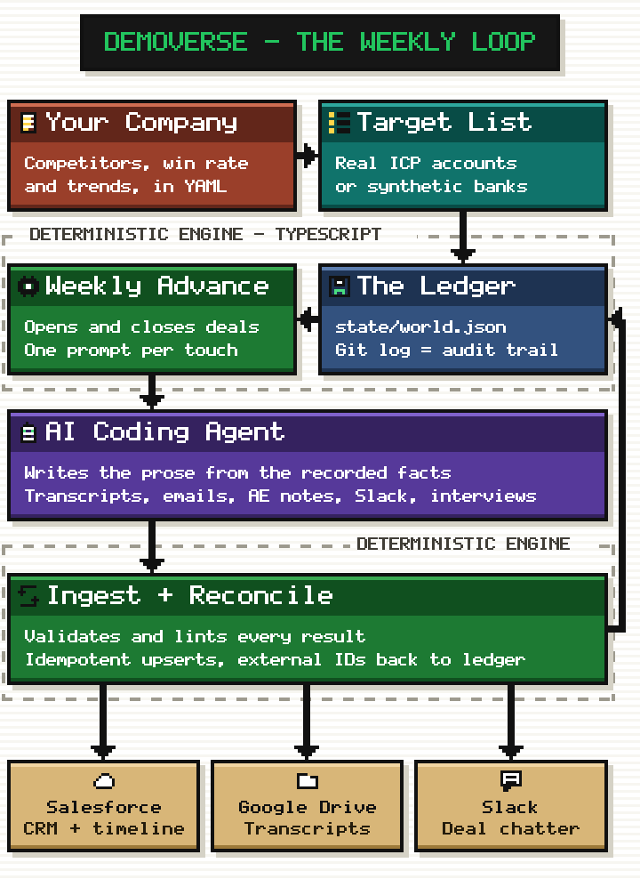
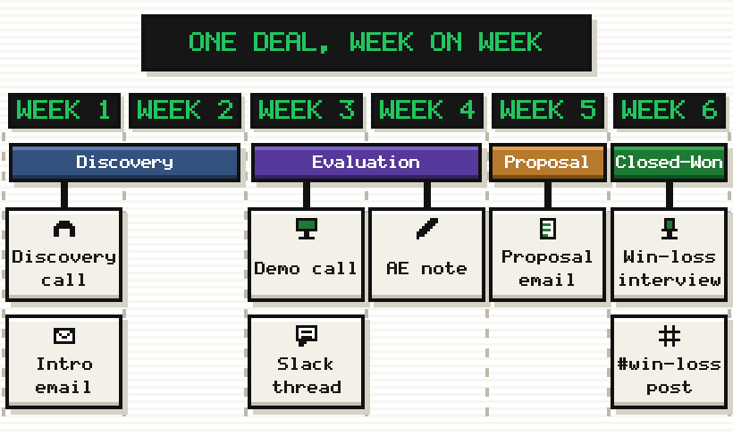

<p align="center">
  
</p>

<h1 align="center">Demoverse</h1>

<p align="center">
  <b>Grow a fake company's entire sales history across CRM, calls, email and Slack.<br> Then keep it moving, week after week.</b>
</p>

<p align="center">
  <a href="https://github.com/calven-ai/demoverse/actions/workflows/ci.yml"></a>
  <a href="LICENSE"></a>
  = 20">
  <a href="CONTRIBUTING.md"></a>
</p>

<p align="center">
  <a href="#quick-start">Quick start</a> ·
  <a href="#how-it-works">How it works</a> ·
  <a href="docs/getting-started.md">Docs</a> ·
  <a href="docs/connectors/build-your-own.md">Connectors</a> ·
  <a href="docs/faq.md">FAQ</a> ·
  <a href="#project-status">Status</a>
</p>

---

Demo data is usually empty, obviously fake, or seeded once and frozen, so the
charts stay flat. Demoverse grows a **fictional company's sales history one week
at a time** instead: a deterministic ledger of accounts, buying committees, deals
and correlated win/loss outcomes, with trends you steer. **Your coding agent
writes the content** (call transcripts, emails, Slack threads, win-loss
interviews) from prompts grounded in that ledger, and a curated cohort of deals
is pushed into [Salesforce](docs/connectors/salesforce.md),
[HubSpot](docs/connectors/hubspot.md),
[Google Drive](docs/connectors/google-drive.md) and
[Slack](docs/connectors/slack.md) (or
[your own connector](docs/connectors/build-your-own.md)), where your product
ingests it like production data.

### Works with

<p align="center">
  <a href="AGENTS.md"></a>
  <a href="AGENTS.md"></a>
  <a href="AGENTS.md"></a>
  <a href="AGENTS.md"></a>
</p>

<p align="center">
  <b><a href="AGENTS.md">Claude Code</a> · <a href="AGENTS.md">Codex</a> · <a href="AGENTS.md">Cursor</a> · <a href="AGENTS.md">any AGENTS.md-aware tool</a></b>
</p>

No model API key and nothing extra to pay: generation runs in the agent you
already use, and connectors stay off until you give them credentials.

## How it works

A **deterministic engine owns every fact**; your **coding agent owns only the
words**, written from prompts that carry those facts, so it can never invent one.

<p align="center">
  
</p>

1. **Configure your company** in `config/*.yaml`: product, competitors,
   personas, sales team, baseline win rate and the trends to tell. The
   `/setup` wizard writes it for you.
2. **A target list seeds the accounts**: a CSV of real ICP companies, or the
   engine's synthetic banks.
3. **The ledger holds the world.** `state/world.json` is the single source of
   truth, committed to git, so the git log is the audit trail.
4. **The weekly advance moves the pipeline**: opens, progresses and closes
   deals, with outcomes correlated to ICP fit, competitor and multi-threading,
   and emits one grounded prompt per touch point a deal earned.
5. **Your agent writes the prose** into result files, one subagent per deal.
6. **Ingest + reconcile**: results are validated and linted for coherence with
   the CRM record, then upserted idempotently to Salesforce, HubSpot, Drive and
   Slack, with external ids recorded back on the ledger.

### One deal, one week at a time

A deal opened this week gets one discovery call, not a full paper trail. Next
week it moves a stage and earns one or two more. Cycle lengths vary per deal, so
the six weeks below are one story, not the template.

<p align="center">
  
</p>

## What makes it believable

- **Grounded, varied prose.** Every prompt carries the deal's facts plus a
  seeded texture (backstory, buyer tone, objections) and a banned-phrase list,
  all editable in `config/prose.yaml`.
- **Realistic imperfection.** Win-loss debriefs are scarce (~1 in 3 closed
  deals), AE notes are terse, and cycle lengths have real tails: one-week
  inbound wins, quarter-long procurement, deals that go dark and die of "No
  decision". Tune it in `config/world.yaml`.
- **Cohort-gated pushes.** The ledger holds hundreds of deals so the statistics
  are real; only a curated ~50, fully populated, reach external systems.

## What Demoverse is not

Not a faker library, not a load-testing dataset, and not for real people or
production systems ([DISCLAIMER.md](DISCLAIMER.md)).

|  | faker-style generators | static demo-org snapshot | **Demoverse** |
| --- | :-: | :-: | :-: |
| Cross-record coherence (CRM ↔ calls ↔ Slack) | ✗ | ✓ | ✓ |
| Long-form prose artifacts | ✗ | ✓ | ✓ |
| Moves forward every week | ✗ | ✗ | ✓ |
| Steerable story ("competitor X gets tougher") | ✗ | ✗ | ✓ |
| Deterministic / reproducible structure | ✓ | ✗ | ✓ |
| Pushes into real SaaS orgs | ✗ | ✗ | ✓ |

## Quick start

**Zero credentials, about five minutes.** The world runs entirely locally.

```bash
git clone https://github.com/calven-ai/demoverse
cd demoverse
npm ci
```

Then open the repo in **Claude Code** and run **`/setup`**. The wizard
interviews you, or invents a company from your one-line idea. It writes the
config, initializes the world, and walks you through your first weekly
increment. In **Codex, Cursor, or any AGENTS.md-aware tool**, say:

> Follow the onboarding playbook in AGENTS.md.

Prefer doing it by hand? Copy `config/templates/*.yaml` → `config/`, fill them
in, then:

```bash
npm run init                      # scaffold the world from your config
npm run pipeline                  # advance one week, emit grounded prompts
# fill state/requests/<n>/results/ (your agent, or you)
npm run apply -- --ingest         # validate + file the prose
npm run lint                      # prove the story is coherent
```

**Then let it run itself.** Push to a private GitHub repo, add a Claude token as
a secret, and the bundled workflow advances the world every Sunday:
[docs/automation.md](docs/automation.md).

**Connect real systems when you're ready.** Each guide takes a few minutes with
a free account, and every connector stays off until you flip it on in
`config/connectors.yaml`:
[Salesforce](docs/connectors/salesforce.md) ·
[Slack](docs/connectors/slack.md) ·
[Google Drive](docs/connectors/google-drive.md) ·
[HubSpot](docs/connectors/hubspot.md)

Full walkthrough: [docs/getting-started.md](docs/getting-started.md).

## FAQ

**Do I need Claude Code?** No, but you do need a coding agent. Any one that
reads [AGENTS.md](AGENTS.md) works (Codex, Cursor, Copilot, …). The agent is
what generates the transcripts, emails and Slack threads, so it isn't an
optional convenience.

**Is the prose AI-generated? What does it cost?** Yes, written by your coding
agent on the subscription you already have. Demoverse never calls a model itself,
so any writer can fill a request, including your own script against any model
API.

**Will it touch my production CRM?** Only systems you explicitly configure, and
it's designed for isolated ones (free Salesforce Developer Edition, throwaway
Slack workspace). Destructive commands are dry-run by default and require
`--confirm`. See [DISCLAIMER.md](DISCLAIMER.md).

**Is it reproducible?** The structural world is fully deterministic from a seed.
Prose varies with whichever agent writes it. Grounding and lint keep it
consistent with the facts either way.

More in [docs/faq.md](docs/faq.md), including why win-loss interviews are
scarce, why the AE notes are deliberately sloppy, and how to point it at a CRM
other than Salesforce.

## Project status

**Complete and maintained**: dependency updates, bug fixes and connector repairs,
but no feature backlog. New capability arrives through two stable seams, the
[connector contract](docs/connectors/build-your-own.md) and the
[request protocol](docs/request-protocol.md), without a fork. Ideas we would
merge are in [CONTRIBUTING.md](CONTRIBUTING.md).

## Contributing

Issues and PRs welcome. Start with [CONTRIBUTING.md](CONTRIBUTING.md). Security
reports go through [SECURITY.md](SECURITY.md), never a public issue. Community
standards live in [CODE_OF_CONDUCT.md](CODE_OF_CONDUCT.md).

## License

[MIT](LICENSE). Built by the team at [Calven](https://calven.ai), where a
private deployment of this engine powers the live product demo.
